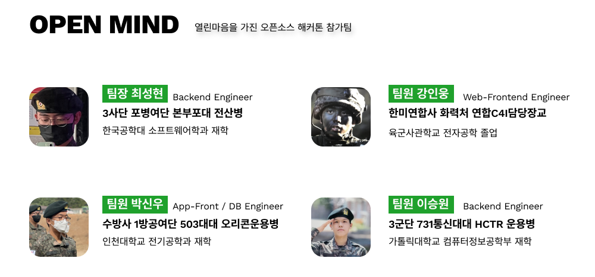
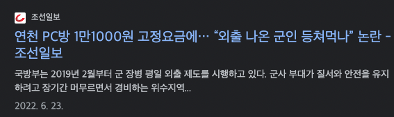
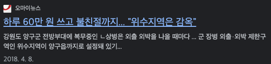
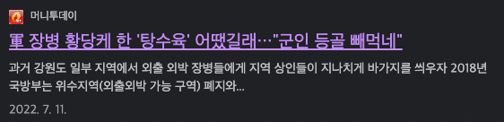
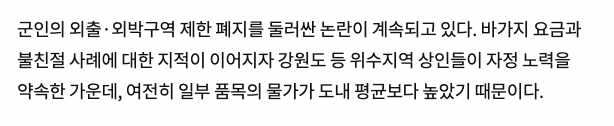

# Goondae-goonde_Open mind

<p align="center">
	<a href="https://friends.kookbang.kr/">
		
	</a>
	<a href="https://kjeonghoon065.gitbook.io/kookbangfriends/">
		
	</a>
	<a href="https://github.com/osamhack2022/WEB_APP_Goondae-goonde_Open-mind/issues?q=is%3Aissue+is%3Aclosed">
		
	</a>
</p>
<p align="center">
	<a href="https://github.com/osamhack2022/WEB_APP_Goondae-goonde_Open-mind/search?l=Python&type=code"></a>
	<a href="https://github.com/osamhack2022/WEB_APP_Goondae-goonde_Open-mind/graphs/contributors"></a>
	<a href="https://github.com/osamhack2022/WEB_APP_Goondae-goonde_Open-mind/stargazers"></a>
	<a href="https://github.com/osamhack2022/WEB_APP_Goondae-goonde_Open-mind/network"></a>
	<a href="https://github.com/osamhack2022/WEB_APP_Goondae-goonde_Open-mind/blob/master/LICENSE"></a>
</p>
<br><br><br>
<hr>
<h2>목차</h2>
<ul>
<li>
<a><p>프로젝트 설명 영상</p></a>
</li>
<li>
<a><p>팀 소개</p></a>
</li>
<li>
<a><p>프로젝트 소개</p></a>
</li>
<li>
<a><p>기능 설계</p></a>
</li>
<li>
<a><p>기능 소개</p></a>
</li>
<li>
<a><p>군데군대의 경쟁력</p></a>
</li>
<li>
<a><p>군데군대의 경쟁력</p></a>
</li>
<li>
<a><p>컴퓨터 구성 / 필수조건안내</p></a>
</li>
<li>
<a><p>기술 스택</p></a>
</li>
<li>
<a><p>협업 툴</p></a>
</li>
<li>
<a><p>프로그램 사용법</p></a>
</li>
<li>
<a><p>저작권 및 사용정보</p></a>
</li>
</ul>
<hr>

<br>
<br>
<br>
<h2 align="center">프로젝트 설명 영상</h2>

<table>
	<tr>
		<td>
			<a href="https://www.youtube.com/watch?v=suvEYpgqv18"></a>
		</td>
		<td>
			<a href="https://www.youtube.com/watch?v=Oh-SFOLAom0"></a>
		</td>
	</tr>
	<tr>
		<td align="center">
			<b>소개 영상</b>
		</td>
		<td align="center">
			<b>가이드 영상</b>
		</td>
	</tr>
</table>

<h4 align="center">이미지 클릭 시 youtube 영상으로 이동합니다.</h4><br><br><br>
<br>

## 팀 소개

<p align="center"><a href="https://raw.githubusercontent.com/osamhack2022/WEB_APP_Goondae-goonde_Open-mind/main/img/TEAM_INFO.png"></a></p>

<br><br>

## 프로젝트 소개

외박,외출,휴가 장병을 위한 플레이스 추천 플랫폼 [군대군데]

<!-- <p align="center"></p> -->


<p><b>군대군데</b>는 위드코로나, 사회적거리두기 완화따라 외출/외박이 풀리기 시작했습니다. 위 사진과 같이 험준하고, 불편한 군대 안에서 20대를 보내고 있을 청춘들에게 2022년에 외출 외박을 나와서 1990년초, 2000년 초와 같은 불편함, 불의를 겪지 않게 하기 위한 프로젝트 입니다.</p>






> 주말 외박에 평일 외출까지 나오는 시대, 위수지역 폐지 논란이 퍼졌었지만, 변화는 없었습니다. 위에서 변화가 없다면, 우리가 최소한의 노력을 해 PC방 11000원 음식은 바가지요금은 내지 않게 하기 위한 프로젝트 입니다.

<br><br>

<p align="center"></p>
   <table><tbody><tr>
   <td width="50%"><h4 align="center"><a href="https://raw.githubusercontent.com/osamhack2020/WEB_KookbangFriends_Woowahan/master/image/0_HOME.jpg"></a><br><br>군데군대 메인화면</h4></td>
   <td width="50%"><h4 align="center"><a href="https://raw.githubusercontent.com/osamhack2020/WEB_KookbangFriends_Woowahan/master/image/0_HOME_MOB.jpg"></a><br><br>모바일 버전</h4></td>
    </tr></tbody></table>
    <br><br>

## 기능 설계

※ 클릭시 확대된 원본 이미지를 확인할 수 있습니다. <br><br>

<table>
        <tbody>
		<tr>
			<td colspan=1>
				<br>
				<b>ㆍ 위치 기반 장소 검색</b><br>
				<br>
			</td>
		</tr>
		<tr>
            <td rowspan="1"><div align="center"><a href="https://raw.githubusercontent.com/osamhack2020/WEB_KookbangFriends_Woowahan/master/image/consulting1.jpg"></a></div></td>
            <td width="33%">내 위치 주변 할인점 검색</td>
        </tr>
        <tr>
            <td rowspan="2"><div align="center"><a href="https://raw.githubusercontent.com/osamhack2020/WEB_KookbangFriends_Woowahan/master/image/consulting2.jpg"></a></div></td>
           <td>별점 기능</td>
        </tr>
        <tr>
           <td>리뷰 기능</td>
        </tr>
   </tbody>
</table>
<br><br>

<table>
        <tbody>
		<tr>
			<td colspan=2>
				<br>
				<b>ㆍ 💖 장소 목록 확인</b><br>
				<br>
			</td>
		</tr>
		<tr>
            <td rowspan="1"><div align="center"><a href="https://raw.githubusercontent.com/osamhack2020/WEB_KookbangFriends_Woowahan/master/image/sns1.jpg"></a></div></td>
            <td width="33%">카테고리별 장소 검색</td>
        </tr>
        <tr>
            <td rowspan="1"><div align="center"><a href="https://raw.githubusercontent.com/osamhack2020/WEB_KookbangFriends_Woowahan/master/image/sns2.jpg"></a></div></td>
           <td width="33%">카카오 지도 연계 위치검색 및 공유</td>
        </tr>
   </tbody>
</table>
<table>
        <tbody>
		<tr>
			<td colspan=2>
				<br>
				<b>ㆍ 📖 게시판 기능</b><br>
				<br>
			</td>
		</tr>
		<tr>
            <td rowspan="1"><div align="center"><a href="https://raw.githubusercontent.com/osamhack2020/WEB_KookbangFriends_Woowahan/master/image/sns1.jpg"></a></div></td>
            <td width="33%">좋아요 기능</td>
        </tr>
   </tbody>
</table>
<br><br>

<table>
        <tbody>
		<tr>
			<td colspan=2>
				<br>
				<b>ㆍ 🥳 로그인/회원가입 기능</b><br>
				<br>
			</td>
		</tr>
		<tr>
            <td rowspan="1"><div align="center"><a href="https://raw.githubusercontent.com/osamhack2020/WEB_KookbangFriends_Woowahan/master/image/registration1.jpg"></a></div></td>
            <td width="33%"> 로그인 시스템 </td>
        </tr>
        <tr>
            <td rowspan="1"><div align="center"><a href="https://raw.githubusercontent.com/osamhack2020/WEB_KookbangFriends_Woowahan/master/image/registration2.jpg"></a></div></td>
            <td width="33%"> 회원가입 시스템 </td>
        </tr>
   </tbody>
</table>
<br><br>

<table>
        <tbody>
		<tr>
			<td colspan=2>
				<br>
				<b>ㆍ 🍀 마이페이지 기능</b><br>
				<br>
			</td>
		</tr>
		<tr>
            <td rowspan="1"><div align="center"><a href="https://raw.githubusercontent.com/osamhack2020/WEB_KookbangFriends_Woowahan/master/image/mypage1.jpg"></a></div></td>
            <td width="33%"> 좋아요 게시물 리스트 확인 </td>
        </tr>
        <tr>
            <td rowspan="1"><div align="center"><a href="https://raw.githubusercontent.com/osamhack2020/WEB_KookbangFriends_Woowahan/master/image/9_LIKE.jpg"></a></div></td>
           <td width="33%">좋아요 장소 확인</td>
        </tr>
   </tbody>
</table>
<br><br>

**지역 내 수만명의 장병들의 힘을 모아, 위수 지역 내 정보를 공유하는 Plat Form "군데군대" 입니다.**

## 기능 설명

- 지방 도시에서의 숙박업소, 음식점을 여러 사이트에서 정보를 수집해 보여줍니다.

- 지도에 나와있지 않은 위수지역 내 숙박시설 및 음식점을 장병들이 추가할 수 있습니다.

- 각 숙박업소 및 음식점은 장병들의 리뷰 및 별점을 통해 정보를 확인할 수 있습니다.

## 군데군대 기대효과

### 🗺 지역 내 군인 할인 점 확인

- 지역 기반 서비스 제공
- 지역 내 군인 할인 제공 지점 제공
- 지역 내 맛집 정보 제공

### 🌐 외출 장소에 관한 소통의 장으로 활용

- 지역 내 장소들에 대한 서비스 품질 확인 가능
- 군인에 대한 차별 등의 요소 공유

### 🖥 SNS Community 형성

- 게시판 시스템을 통한 정보 공유
- 게시판 내 공감시스템 활용 정보의 용이성 파악

  <br><br>

## 군대군데가 가진 경쟁력

<br>

### 📘 개발문서의 구체성

구체적인 개발문서의 양호도 및 구체적 표현성

- Gitbook을 이용한 개발문서 정리
- Database ERD 제공
- OPEN API 제공

### 🌟 독창성

뚜렷한 독창성 유무 정도

- 자율과제 및 지정과제를 포함한 추가 기능 구현
- SNS 서비스를 통한 국방 소셜 네트워크 구축
- 카카오톡과 연동하여 새로운 플랫폼 활용도 기대
- 웹/모바일 완벽 지원 및 PWA를 이용한 앱 활용 가능

### 🌱 발전 가능성

커뮤니티, 비즈니스 등에 대한 발전 가능성

- 비대면 상담 서비스, 국방 SNS 기능을 통한 커뮤니티 구축
- 누구나 쉽게 서비스를 관리할 수 있도록 데이터 관리 페이지 구축
- 오픈소스로 이루어진 프로그램으로 플랫폼 구축 비용 절감
- 구체적인 개발문서 정리로 개발 관련 커뮤니티 발전도 가능

### 🚀 완성도(작품데모)

데모 결과에 대한 시현 능숙도 및 원활한 작동

- 즉시 서비스를 시행할 수 있도록 완성도 있게 제작
- 모든 기능들은 사용자별 권한 설정이 완료 되고 원활하게 구현되어짐
- 관리자 페이지를 제공하여 보다 체계적인 관리가 가능

## 컴퓨터 구성 / 필수 조건 안내 (Prerequisites)

<!-- <p></p> -->

<br><br>

## 기술 스택 (Technique Used)

<!-- <h3 align="center"></h3> -->

### Infra

<table><tbody>
 <tr>
  <td>
   <div align="center"><a href="https://git-scm.com/" target="_blank">  </a><br>Git</div>
  </td>
  <td>
   <div align="center"><a href="https://www.docker.com/" target="_blank"> 
            
           </a><br>docker</div>
  </td>
 </tr>
 </tbody></table>
 
### Back-end
<table><tbody>
 <tr>
  <td width="60">
   <div align="center"><a href="https://nodejs.org" target="_blank"> 
            
    </a><br>Node.js</div>

  </td>
  <td width="60">
   <div align="center"><a href="https://expressjs.com" target="_blank">  
            
    </a><br>Express</div>
  </td>
  <td width="60">
   <div align="center"><a href="https://developer.mozilla.org/en-US/docs/Web/JavaScript" target="_blank"> 
            
           </a><br>Javascript</div>
  </td>
  <td width="60">
   <div align="center"><a href="https://strapi.io/" target="_blank">  </a><br>Strapi</div>
  </td>
  <td width="60">
   <div align="center"><a href="https://www.linux.org/" target="_blank"> 
            
           </a><br>Linux</div>
  </td>
  <td width="60">
   <div align="center"><a href="https://www.nginx.com" target="_blank"> 
    </a><br>Nginx</div>
  </td>
  <td width="60">
   <div align="center"><a href="https://jwt.io" target="_blank">  </a><br>JWT</div>
  </td>
  </td>
  <td width="60">
   <div align="center"><a href="https://letsencrypt.org/" target="_blank">  </a><br>SSL</div>
  </td>
 </tr>
 </tbody></table>
  
### Front-end
<table><tbody>
 <tr>
  <td>
   <div align="center"><a href="https://reactjs.org/" target="_blank"> 
            
           </a><br>React.js</div>
  </td>
  <td width="60">
   <div align="center"><a href="https://developer.mozilla.org/en-US/docs/Web/JavaScript" target="_blank">  </a><br>Javascript</div>
  </td>
  <td>
   <div align="center"><a href="https://www.w3.org/html/" target="_blank"> 
             </a><br>tailwindcss</div>
  </td>
    <td>
   <div align="center"><a href="https://www.w3.org/html/" target="_blank"> 
             </a><br>Html5</div>
  </td>
  <td>
   <div align="center"><a href="https://babeljs.io/" target="_blank">  </a><br>Babel</div>
  </td>
  <td>
   <div align="center"><a href="https://webpack.js.org" target="_blank"> 
             </a><br>Webpack</div>
  </td>

 </tr>
 </tbody></table>
 
 ### Database
 <table><tbody>
 <tr>
  <td>
   <div align="center"><a href="https://www.mongodb.com/" target="_blank"> 
             </a><br>MongoDB</div>
  </td></tr>
 </tbody></table>
 
 ### Web Skills
<table>
	<tbody>
		<tr>
	  		<td width="200" align="center">
				반응형 웹<br>
				(Responsive Web)
	  		</td>
			<td width="200" align="center">
				크로스 브라우징<br>
				(Cross Browsing)
	  		</td>
			<td width="200" align="center">
				웹 표준<br>
				(Web Standards)
	  		</td>
			<td width="200" align="center">
				SEO 검색엔진최적화<br>
				(Search Engine Optimization)
	  		</td>
		</tr>
	 </tbody>
</table>
<table>
	<tbody>
		<tr>
			<td width="200" align="center">
				SSR<br>
				(Server Side Rendering)
	  		</td>
			<td width="200" align="center">
				CSR<br>
				(Client Side Rendering)
	  		</td>
			<td width="200" align="center">
				PWA<br>
				(Progressive Web Apps)
	  		</td>
		</tr>
	 </tbody>
</table>
<br><br>

## 협업 툴 이용

### git

#### git flow 전략

> Frontend 기준 develop_v1 => feature/intro, feature/login, feature/dateedit / develop_v1에서 issue 해결을 위해 hotfix 브랜치 이용

- main : 기준이 되는 브랜치로 제품을 배포하는 브랜치 입니다.
- develop : 개발 브랜치로 개발자들이 이 브랜치를 기준으로 각자 작업한 기능들을 합(Merge)칩니다.
- feature : 단위 기능을 개발하는 브랜치로 기능 개발이 완료되면 develop 브랜치에 합칩니다.
- hotfix : master 브랜치로 배포를 했는데 버그가 생겼을 떄 긴급 수정하는 브랜치 입니다.

#### commit log

출처: https://jryoun1.github.io/git/gitCommitLog/

**[Git] git commit log 작성 방법**

- subject와 body 사이는 한 줄 띄워 구분하기
- subject line의 글자수는 50자 이내로 제한하기
- subject line의 첫 글자는 대문자 사용하기
- subject line의 마지막에 마침표(.)

#### 코드 리뷰

> Pull Request를 다른 프론트엔드 혹은 백엔드 팀원이 확인 및 피드백을 통해, 팀원들의 진행 상황과 전체적인 프로젝트의 흐름을 확인

### Figma

> 구현되기 전의 디자인의 전체적인 모습을 팀원들과 공유하기 위해 활용

### Trello

> 각자 팀원들의 전체적인 작업도를 확인하기 위해 활용

## 프로젝트 사용법 (Getting Started)

### 설치 안내 (Installation Process)

```bash
$ git clone git주소
[Front]
$ yarn or npm install
$ yarn start or npm run start
[Back]
$ cd WEB\(BE\)
$ pip install -r requirements.txt
$ python manage.py runserver

```

## 저작권 및 사용권 정보 (Copyleft / End User License)

- [MIT](https://github.com/osamhack2022/WEB_APP_Goondae-goonde_Open-mind/blob/main/LICENSE)

This project is licensed under the terms of the MIT license.
