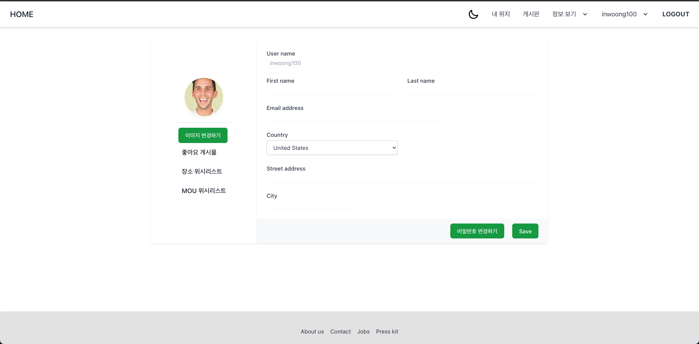

# Goondae-goonde_Open mind

<div align="center">
  
</div>
<p>&nbsp;</p>
<p align="center">
	<a href="https://www.youtube.com/watch?v=Wa4uaZ68Z_A">
		
	</a>
	<a href="http://ec2-52-79-185-182.ap-northeast-2.compute.amazonaws.com:8000/swagger">
		
	</a>
	<a href="https://github.com/osamhack2022/WEB_APP_Goondae-goonde_Open-mind/issues?q=is%3Aissue+is%3Aclosed">
		
	</a>
</p>
<p align="center">
	<a href="https://github.com/osamhack2022/WEB_APP_Goondae-goonde_Open-mind/search?l=Python&type=code"></a>
	<a href="https://github.com/osamhack2022/WEB_APP_Goondae-goonde_Open-mind/graphs/contributors"></a>
	<a href="https://github.com/osamhack2022/WEB_APP_Goondae-goonde_Open-mind/stargazers"></a>
	<a href="https://github.com/osamhack2022/WEB_APP_Goondae-goonde_Open-mind/network"></a>
	<a href="https://github.com/osamhack2022/WEB_APP_Goondae-goonde_Open-mind/blob/master/LICENSE"></a>
</p>
<br><br><br>
<hr>
<h2>목차</h2>
<ol>
<li>
<a href="#project-introduce-video"><p>프로젝트 설명 영상</p></a>
</li>
<li>
<a href="#team-introduce"><p>팀 소개</p></a>
</li>
<li>
<a href="#project-intro"><p>프로젝트 소개</p></a>
<ul>
<li><a href="#painpoint"><p>pain point</p></a></li>
<li><a href="#solution"><p>solution</p></a></li>
</ul>
</li>
<li>
<a href="#todo-introduce"><p>기능 소개</p></a>
</li>
<li>
<a href="#todo-architechture"><p>기능 설계</p></a>
</li>

<li>
<a href="#effect"><p>군대군데 기대효과</p></a>
</li>
<li>
<a href="#benefit"><p>군대군데 경쟁력</p></a>
</li>
<li>
<a href="#must-computer"><p>컴퓨터 구성 / 필수조건안내</p></a>
</li>
<li>
<a href="#tech-stach"><p>기술 스택</p></a>
</li>
<li>
<a href="#wego-together"><p>협업 툴</p></a>
</li>
<li>
<a href="#how-to-do"><p>프로그램 사용법</p></a>
</li>
<li>
<a href="#usage"><p>저작권 및 사용정보</p></a>
</li>
</ol>

<br>
<br>
<br>
<h2 id="project-introduce-video" align="center">프로젝트 설명 영상</h2>
<hr><br>

<table>
	<tr>
		<td>
			<a href="https://www.youtube.com/watch?v=Wa4uaZ68Z_A"></a>
		</td>
		<td>
			<a href="https://www.youtube.com/watch?v=Wa4uaZ68Z_A"></a>
		</td>
	</tr>
	<tr>
		<td align="center">
			<b>소개 영상</b>
		</td>
		<td align="center">
			<b>가이드 영상</b>
		</td>
	</tr>
</table>

<h4 align="center">이미지 클릭 시 youtube 영상으로 이동합니다.</h4><br><br><br>
<br>

<h2 id="team-introduce" align="center">팀 소개</h2>
<hr><br>
<p align="center">
<a href="https://raw.githubusercontent.com/osamhack2022/WEB_APP_Goondae-goonde_Open-mind/main/img/TEAM_INFO.png"></a></p>

<br><br>

<h2 id="project-intro" align="center">프로젝트 소개</h2>
<hr>
<br>
<p align="center">장병들의 윤택한 외출, 외박을 위한 플레이스 추천 플랫폼 [군대군데]</p>

<div align="center">
  
</div>


 <p>위드코로나, 사회적거리두기 완화따라 외출,외박이 다시 가능한 시대가 돌아 왔습니다. 위 사진과 같은 험준하고, 낯선 군대 안에서 20대의 청춘을 보내고 있을 우리 장병들에게 2022년에도 외출 외박을 나와서 1990년초, 2000년 초에 겪었던 불편함과 차별을 당하지 않도록 하기 위한 프로젝트가 <b>군대군데</b>입니다.</p>


> 주말 외박에 평일 외출까지 나오는 시대, 위수지역 폐지 논란이 퍼졌었지만, 변화는 없었습니다. 위에서 변화가 없다면, 우리가 최소한의 노력을 해 PC방 11000원 음식은 바가지요금은 내지 않게 하기 위한 프로젝트 입니다.

<br><br>

<h3 id="painpoint">🩼 Pain Point</h3>

1. 군 주변 지역 특성 상 군인들에게 바가지 요금, 낮은 품질의 서비스를 제공한다.

2. 정보의 부족으로, 군 혜택을 제대로 누리지 못하고 있다.

<br>

<h3 id="solution">⭐️ Solution </h3>

1. 부대 주변의 장소들에 대한 별점, 리뷰를 작성하는 커뮤니티를 제공한다.

2. 군인들만을 위한 커뮤니티를 제공한다.

3. 군인에게 혜택을 제공하는 장소, MOU 업체, TMO에 대한 정보를 통합하여 제공한다.
   <br><br>

<p align="center"></p>
   <table><tbody><tr>
   <td width="50%"><h4 align="center"><a
href="https://raw.githubusercontent.com/osamhack2022/WEB_APP_Goondae-goonde_Open-mind/main/img/0_HOME.png"></a><br><br>군데군대 메인화면</h4></td>
   <td width="50%"><h4 align="center"><a
href="https://raw.githubusercontent.com/osamhack2022/WEB_APP_Goondae-goonde_Open-mind/main/img/0_HOME_MOB.png"></a><br><br>모바일 버전</h4></td>
    </tr></tbody></table>
    </tr></tbody></table>
    <br><br>

<h2 id="todo-introduce" align="center">기능 소개</h2>
<hr><br>

- 지방 도시에서의 숙박업소, 음식점을 여러 사이트에서 정보를 수집해 보여줍니다.

- 지도에 나와있지 않은 위수지역 내 숙박시설 및 음식점을 장병들이 추가할 수 있습니다.

- 각 숙박업소 및 음식점은 장병들의 리뷰 및 별점을 통해 정보를 확인할 수 있습니다.

<br><br>

<h2 id="todo-architechture" align="center">기능 설계</h2>
<hr>
※ 클릭시 확대된 원본 이미지를 확인할 수 있습니다.
<br>
<table>
        <tbody>
		<tr>
			<td colspan=1>
				<br>
				<b>ㆍ 🗺 위치 기반 장소 확인</b><br>
				<br>
			</td>
		</tr>
		<tr>
            <td rowspan="1"><div align="center"><a 
href="https://raw.githubusercontent.com/osamhack2022/WEB_APP_Goondae-goonde_Open-mind/main/img/1_MYLOCATION2.png"></a></div></td>
            <td width="33%">내 위치 주변 군인 혜택 장소 확인</td>
        </tr>
        <tr>
            <td rowspan="2"><div align="center"><a
href="https://raw.githubusercontent.com/osamhack2022/WEB_APP_Goondae-goonde_Open-mind/main/img/1_MYLOCATION.png"></a></div></td>
           <td>이동된 지역 주변 군인 혜택 장소 확인</td>
        </tr>
   </tbody>
</table>
<br><br>

<table>
        <tbody>
		<tr>
			<td colspan=2>
				<br>
				<b>ㆍ 💖 군인 혜택 장소 확인</b><br>
				<br>
			</td>
		</tr>
		<tr>
            <td rowspan="1"><div align="center"><a 
href="https://raw.githubusercontent.com/osamhack2022/WEB_APP_Goondae-goonde_Open-mind/main/img/2_CATEGORY.png"></a></div></td>
            <td width="33%">카테고리별 장소 검색</td>
        </tr>
        <tr>
            <td rowspan="2"><div align="center"><a 
href="https://raw.githubusercontent.com/osamhack2022/WEB_APP_Goondae-goonde_Open-mind/main/img/2_REPLY.png"></a></div></td>   
          <td>
            좋아요 기능  
          </td>
        </tr>
        <tr>
            <td>댓글기능</td>
        </tr>
        <tr>
      <td rowspan="1">
        <div align="center">
          <a href="https://raw.githubusercontent.com/osamhack2022/WEB_APP_Goondae-goonde_Open-mind/main/img/2_LIKE.png"></a>
        </div>
      </td>
      <td width="33%">사용자 좋아요 모음</td>
    </tr>
   </tbody>
</table>
<table>
        <tbody>
		<tr>
			<td colspan=2>
				<br>
				<b>ㆍ 💖 군 MOU 장소 확인</b><br>
				<br>
			</td>
		</tr>
		<tr>
      <td rowspan="1">
        <div align="center">
          <a href="https://raw.githubusercontent.com/osamhack2022/WEB_APP_Goondae-goonde_Open-mind/main/img/3_MOU.png"></a>
        </div>
      </td>
      <td width="33%">MOU 내용 확인</td>
    </tr>
    <tr>
      <td rowspan="2">
        <div align="center"><a href="https://raw.githubusercontent.com/osamhack2022/WEB_APP_Goondae-goonde_Open-mind/main/img/3_REPLY.png"></a>
        </div>
      </td>   
      <td>
        좋아요 기능  
      </td>
    </tr>
    <tr>
      <td>댓글기능</td>
    </tr>
    		<tr>
      <td rowspan="1">
        <div align="center">
          <a href="https://raw.githubusercontent.com/osamhack2022/WEB_APP_Goondae-goonde_Open-mind/main/img/3_LIKE.png"></a>
        </div>
      </td>
      <td width="33%">사용자 좋아요 모음</td>
    </tr>
   </tbody>
</table>

<table>
        <tbody>
		<tr>
			<td colspan=1>
				<br>
				<b>ㆍ 💖 TMO 정보 확인</b><br>
				<br>
			</td>
		</tr>
    <tr>
      <td rowspan="1">
        <div align="center">
          <a href="https://raw.githubusercontent.com/osamhack2022/WEB_APP_Goondae-goonde_Open-mind/main/img/4_TMO.png"></a>
        </div>
      </td>
      <td width="33%">TMO 목록 확인</td>
    </tr>
        <tr>
            <td rowspan="2"><div align="center"><a 
href="https://raw.githubusercontent.com/osamhack2022/WEB_APP_Goondae-goonde_Open-mind/main/img/4_LIKE.png"></a></div></td>   
          <td>
            TMO 위치 확인  
          </td>
        </tr>
        <tr>
            <td>TMO 휴무일 등 확인</td>
        </tr>
        
   </tbody>
</table>
<table>
        <tbody>
		<tr>
			<td colspan=2>
				<br>
				<b>ㆍ 📖 게시판 기능</b><br>
				<br>
			</td>
		</tr>
		<tr>
            <td rowspan="1"><div align="center"><a 
href="https://raw.githubusercontent.com/osamhack2022/WEB_APP_Goondae-goonde_Open-mind/main/img/6_BOARDS.png"></a></div></td>
            <td width="33%">CRUD 기능</td>
    </tr>
    <tr>
            <td rowspan="1"><div align="center"><a 
href="https://raw.githubusercontent.com/osamhack2022/WEB_APP_Goondae-goonde_Open-mind/main/img/6_LIKE.png"></a></div></td>
            <td width="33%">좋아요 기능</td>
    </tr>
   </tbody>
</table>
<br><br>

<table>
        <tbody>
		<tr>
			<td colspan=3>
				<br>
				<b>ㆍ 🥳 로그인/회원가입 기능</b><br>
				<br>
			</td>
		</tr>
		<tr>
            <td rowspan="1"><div align="center"><a 
href="https://raw.githubusercontent.com/osamhack2022/WEB_APP_Goondae-goonde_Open-mind/main/img/7_LOGIN.png"></a></div></td>
            <td width="33%"> 로그인 시스템 </td>
        </tr>
        <tr>
            <td rowspan="1"><div align="center"><a 
href="https://raw.githubusercontent.com/osamhack2022/WEB_APP_Goondae-goonde_Open-mind/main/img/7_REGISTER.png"></a></div></td>
            <td width="33%"> 회원가입 시스템 </td>
        </tr>
                <tr>
            <td rowspan="1"><div align="center"><a 
href="https://raw.githubusercontent.com/osamhack2022/WEB_APP_Goondae-goonde_Open-mind/main/img/7_CONFIRM.png"></a></div></td>
            <td width="33%">이메일 인증 시스템</td>
        </tr>
   </tbody>
</table>
<br><br>

<table>
        <tbody>
		<tr>
			<td colspan=2>
				<br>
				<b>ㆍ 🍀 마이페이지 기능</b><br>
				<br>
			</td>
		</tr>
		<tr>
            <td rowspan="1"><div align="center"><a 
href="https://raw.githubusercontent.com/osamhack2022/WEB_APP_Goondae-goonde_Open-mind/main/img/8_MYPAGE.png"></a></div></td>
            <td width="33%">내 정보, 이미지 수정 </td>
        </tr>
        <tr>
            <td rowspan="2"><div align="center"><a 
href="https://raw.githubusercontent.com/osamhack2022/WEB_APP_Goondae-goonde_Open-mind/main/img/8_LIKE.png"></a></div></td>
           <td width="33%"> 좋아요 게시물 리스트 확인</td>
        </tr>
        <tr>
            <td>좋아요 혜택, MOU 업체 확인</td>
        </tr>
        
   </tbody>
</table>
<table>
        <tbody>
		<tr>
			<td colspan=2>
				<br>
				<b>ㆍ 📱 모바일 앱 제공</b><br>
				<br>
			</td>
		</tr>
		<tr>
            <td rowspan="1"><div align="center"><a 
href="https://raw.githubusercontent.com/osamhack2022/WEB_APP_Goondae-goonde_Open-mind/main/img/9_WEBVIEW.png"></a></div></td>
            <td width="33%"> 모바일 앱 내 웹뷰를 제공 </td>
        </tr>
        <tr>
            <td rowspan="1"><div align="center"><a 
href="https://raw.githubusercontent.com/osamhack2022/WEB_APP_Goondae-goonde_Open-mind/main/img/8_MAP.jpg"></a></div></td>
           <td width="33%">모바일 앱 내 지도를 통한 정보 제공</td>
        </tr>
   </tbody>
</table>
<table>
        <tbody>
		<tr>
			<td colspan=2>
				<br>
				<b>ㆍ 🧑‍💼 관리자 페이지 제공</b><br>
				<br>
			</td>
		</tr>
		<tr>
            <td rowspan="1"><div align="center"><a 
href="https://raw.githubusercontent.com/osamhack2022/WEB_APP_Goondae-goonde_Open-mind/main/img/10_ADMIN.png"></a></div></td>
            <td width="33%"> 사용자, 게시물, 리뷰등 관리하는 페이지 제공 </td>
        </tr>
   </tbody>
</table>
<br><br>

**지역 내 수만명의 장병들의 힘을 모아, 위수 지역 내 정보를 공유하는 Plat Form "군데군대" 입니다.**

<br><br><br>

<h2 id="effect" align="center">군대군데 기대효과</h2>
<hr><br>

### 🗺 지역 내 군인 할인 점 확인

- 지역 기반 서비스 제공
- 지역 내 군인 할인 제공 지점 제공
- 지역 내 맛집 정보 제공

<br>

### 🌐 외출 장소에 관한 소통의 장으로 활용

- 지역 내 장소들에 대한 서비스 품질 확인 가능
- 군인에 대한 차별 등의 요소 공유

<br>

### 🖥 SNS Community 형성

- 게시판 시스템을 통한 정보 공유
- 게시판 내 공감시스템 활용 정보의 용이성 파악

  <br><br>

<h2 id="benefit" align="center"> 군대군데가 가진 경쟁력</h2>
<hr>
<br>

### 📘 개발문서의 구체성

구체적인 개발문서의 양호도 및 구체적 표현성

- Swagger를 이용한 개발문서 정리
- Database ERD 제공
- OPEN API 제공

### 🌟 독창성

뚜렷한 독창성 유무 정도

- 자율과제 및 지정과제를 포함한 추가 기능 구현
- 게시판을 통한 MOU, TMO, 군 지역내 서비스에 대한 SNS 구축
- 반응형 웹페이지로 구성, 앱 내 웹뷰를 사용한 앱 구축

### 🌱 발전 가능성

커뮤니티, 비즈니스 등에 대한 발전 가능성

- 많은 장병들의 사용을 통해 더 큰 커뮤니티와 활용 가능성 존재
- 오픈소스로 이루어진 프로그램으로 플랫폼 구축 비용 절감
- Swagger를 통한 Documents 제공을 통해, 서비스 확대 가능

### 🚀 완성도(작품데모)

데모 결과에 대한 시현 능숙도 및 원활한 작동

- 즉시 서비스를 시행할 수 있도록 완성도 있게 제작
- 모든 기능들은 사용자별 권한 설정이 완료 되고 원활하게 구현되어짐
- Django를 통한 관리자 페이지 제공을 통해 원활한 관리 가능
  <br><br><br>

<h2 id="must-computer" align="center">컴퓨터 구성 / 필수 조건 안내 (Prerequisites)</h2>
<hr>

<h4> 🌏: 브라우저 </h4>

- ECMAScript 6 지원 브라우저 사용
- 권장: Google Chrome 버젼 77 이상

<table width="900">

<thead>

<tr>

<th width="180" align="center"> Chrome</th>

<th width="240" align="center"> Internet Explorer</th>

<th width="180" align="center"> Edge</th>

<th width="180" align="center"> Safari</th>

<th width="180" align="center"> Firefox</th>

</tr>

</thead>

<tbody>

<tr>
<td align="center">YES</td>
<td align="center">11+</td>
<td align="center">YES</td>
<td align="center">YES</td>
<td align="center">YES</td>
</tr>

</table>

<br/>

---

<!-- <p></p> -->

<br><br>

<h2 id="tech-stach" align="center">기술 스택 (Technique Used)</h2>
<hr>
<br>
<!-- <h3 align="center"></h3> -->

### Infra

<table><tbody>
 <tr>
  <td>
   <div align="center"><a href="https://git-scm.com/" target="_blank">  </a><br>Git</div>
  </td>
  <td>
   <div align="center"><a href="https://aws.amazon.com/" target="_blank"> 
            
           </a><br>AWS</div>
  </td>
 </tr>
 </tbody></table>
 <br>

### Back-end

<table><tbody>
 <tr>
  <td width="60">
   <div align="center"><a href="https://www.python.org/" target="_blank"> 
            
    </a><br>Python</div>
  </td>
  <td width="60">
   <div align="center"><a href="https://www.djangoproject.com/" target="_blank">  
            
    </a><br>Django</div>
  </td>
  <td width="60">
   <div align="center"><a href="https://swagger.io/" target="_blank"> 
            
           </a><br>Swagger</div>
  </td>
 </tr>
 </tbody></table>
  <br>

### Front-end

<table><tbody>
 <tr>
  <td>
   <div align="center"><a href="https://reactjs.org/" target="_blank"> 
            
           </a><br>React.js</div>
  </td>
  <td width="60">
   <div align="center"><a href="https://developer.mozilla.org/en-US/docs/Web/JavaScript" target="_blank">  </a><br>Javascript</div>
  </td>
  <td>
   <div align="center"><a href="https://www.w3.org/html/" target="_blank"> 
             </a><br>HTML5</div>
  </td>
    <td>
   <div align="center"><a href="https://www.w3.org/html/" target="_blank"> 
             </a><br>Tailwindcss</div>
  </td>
  <td>
   <div align="center"><a href="https://babeljs.io/" target="_blank">  </a><br>Babel</div>
  </td>
  <td>
   <div align="center"><a href="https://webpack.js.org" target="_blank"> 
             </a><br>Webpack</div>
  </td>

 </tr>
 </tbody></table>
 <br>

### App

<table><tbody>
 <tr>
  <td>
   <div align="center"><a href="https://flutter.dev" target="_blank">  </a><br>Flutter</div>
  </td>
  <td>
   <div align="center"><a href="https://dart.dev" target="_blank"> 
            
           </a><br>Dart</div>
  </td>
 </tr>
 </tbody></table>
 <br>

### Database

 <table><tbody>
 <tr>
  <td>
   <div align="center"><a href="https://www.sqlite.org/index.html" target="_blank"> 
             </a><br>SQLite</div>
  </td></tr>
 </tbody></table>
 <br>

### Web Skills

<table>
	<tbody>
		<tr>
	  		<td width="200" align="center">
				반응형 웹<br>
				(Responsive Web)
	  		</td>
			<td width="200" align="center">
				크로스 브라우징<br>
				(Cross Browsing)
	  		</td>
			<td width="200" align="center">
				웹 표준<br>
				(Web Standards)
	  		</td>
            <td width="200" align="center">
				CSR<br>
				(Client Side Rendering)
	  		</td>
		</tr>
	 </tbody>
</table>

<br><br><br>

<h2 id="wego-together" align="center">협업 툴 이용</h2>
<hr><br>

### git

<br>

#### git flow 전략

> Frontend 기준 develop_v1 => feature/intro, feature/login, feature/dateedit / develop_v1에서 issue 해결을 위해 hotfix 브랜치 이용

- main : 기준이 되는 브랜치로 제품을 배포하는 브랜치 입니다.
- develop : 개발 브랜치로 개발자들이 이 브랜치를 기준으로 각자 작업한 기능들을 합(Merge)칩니다.
- feature : 단위 기능을 개발하는 브랜치로 기능 개발이 완료되면 develop 브랜치에 합칩니다.
- hotfix : master 브랜치로 배포를 했는데 버그가 생겼을 떄 긴급 수정하는 브랜치 입니다.

#### commit log

출처: https://jryoun1.github.io/git/gitCommitLog/

**[Git] git commit log 작성 방법**

- subject와 body 사이는 한 줄 띄워 구분하기
- subject line의 글자수는 50자 이내로 제한하기
- subject line의 첫 글자는 대문자 사용하기
- subject line의 마지막에 마침표(.)

#### 코드 리뷰

> Pull Request를 다른 프론트엔드 혹은 백엔드 팀원이 확인 및 피드백을 통해, 팀원들의 진행 상황과 전체적인 프로젝트의 흐름을 확인

<br>

### Figma

[👉🏻 OPENMIND Figma 페이지 이동 ](https://www.figma.com/file/ydqRIxIeWw0D2HRzHx6SRm/%EA%B5%B0%EB%8C%80%EA%B5%B0%EB%8D%B0?node-id=0%3A1)
<br>

> 기획단계에서의 결과물을 도출 및 의견 공유를 위해 사용
>
> 1. IA를 구성하여 기능 구현
> 2. 와이어프레임을 팀원들과 공유

<br>

<h4>Information Architecture</h4>

<div align="center">
<image src="img/IA_IMAGE.png"/>
</div>
 
<br>
<h4>Wire Frame</h4>

<div align="center">
<image src="img/WIREFRAME_IMAGE.png"/>
</div>

<br>

### Trello

<br>

> 각자 팀원들의 전체적인 작업도를 확인하기 위해 활용

<br><br><br>

<h2 id="how-to-do" align="center">프로젝트 사용법 (Getting Started)</h2>
<hr><br>

### 초기 설치 순서 및 실행법 (Installation Process)

<br>

#### 초기 설치 순서

```bash
1. 프로젝트 설치
$ git clone git주소

2. Front 설치
(WEB_APP_Goondae-goonde_Open-mind\WEB(FE))
$ yarn or npm install

3. Back 설치
(WEB_APP_Goondae-goonde_Open-mind\WEB(BE))
$ pip install -r requirements.txt
```

> Back 초기 세팅 <br>
> (/WEB_APP_Goondae-goonde_Open-mind/WEB(BE)/myboard/settings.py)
>
> ```python
> EMAIL_HOST_USER = '*' # 발신할 이메일 : 계정 인증 메일을 보낼 gmail 주소를 입력하세요.
>
> EMAIL_HOST_PASSWORD = '*' # 발신할 메일의 비밀번호 : 보안 - 2단계 인증 사용 설정 후 앱 비밀번호 를 생성하여 입력하세요.
> ```

```bash
4. Back db 생성
$ python manage.py makemigrations
$ python manage.py migrate

4. 크롤링
(WEB_APP_Goondae-goonde_Open-mind\WEB(BE)\crawler)
$ python main.py
```

> 크롤러 초기 세팅 <br>
> (WEB_APP_Goondae-goonde_Open-mind/WEB(BE)/crawler/crawling)
>
> ```python
> # kakao rest api key
> self.rest_key = '*'
> ```
>
> 위 코드에서 \* 부분을 https://developers.kakao.com/console/app 에서 발급받은 REST API 키로 변경해주세요.

> 크롤링 순서
>
> 1.  지역 업소 정보 크롤링<br>
>     지역 선택 크롤링 → db → 5. data_proccesing(카카오 REST API KEY 필수) → 2. db.into_db() → back
> 2.  MOU 정보 크롤링<br>
>     (88)MOUdata → db → 7. MOU_into_db() → back
> 3.  TMO 정보 크롤링<br>
>     (99)TMOdata → db → 10. TMO_into_db → back
> 4.  종료<br>
>     exit

#### 실행법

```bash
[Back]
(WEB_APP_Goondae-goonde_Open-mind\WEB(BE))
$ python manage.py runserver

[Front]
(WEB_APP_Goondae-goonde_Open-mind\WEB(FE))
$ npm start

```

<br>

### Android app 설치안내

[- 구글 드라이브에서 빌드 된 앱 다운로드](https://drive.google.com/file/d/1Oh8wqNz3fny8tXhNVuCpREfjdsfaOL4O/view?usp=drivesdk)

- Flutter로 직접 빌드

1. 프로젝트 폴더에 접근

```
$ cd APP/gdgd_app
```

2. 다음 명령어로 apk파일 빌드(Flutter 개발환경 구축 필요)

```
$ flutter build apk --no-sound-null-safey
```

3. 프로젝트 폴더의 build/app/outputs/flutter-apk/ 안에 있는 app-release.apk 파일을 다운로드 하여 안드로이드 기기에서 설치 및 실행

<br><br><br>

<h2 id="usage" align="center">저작권 및 사용권 정보 (Copyleft / End User License)</h2>
<hr>

<br>

- [MIT](https://github.com/osamhack2022/WEB_APP_Goondae-goonde_Open-mind/blob/main/LICENSE)

This project is licensed under the terms of the MIT license.
